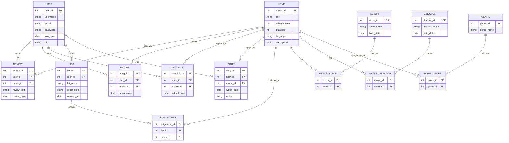

```mermaid
erDiagram

    USER {
        int user_id PK
        string username
        string email
        string password
        date join_date
        string bio
    }

    MOVIE {
        int movie_id PK
        string title
        int release_year
        int duration
        string language
        string description
    }

    REVIEW {
        int review_id PK
        int user_id FK
        int movie_id FK
        string review_text
        date review_date
    }

    RATING {
        int rating_id PK
        int user_id FK
        int movie_id FK
        float rating_value
    }

    WATCHLIST {
        int watchlist_id PK
        int user_id FK
        int movie_id FK
        date added_date
    }

    LIST {
        int list_id PK
        int user_id FK
        string list_name
        string description
        date created_at
    }

    LIST_MOVIES {
        int list_movie_id PK
        int list_id FK
        int movie_id FK
    }

    ACTOR {
        int actor_id PK
        string actor_name
        date birth_date
    }

    DIRECTOR {
        int director_id PK
        string director_name
        date birth_date
    }

    GENRE {
        int genre_id PK
        string genre_name
    }

    DIARY {
        int diary_id PK
        int user_id FK
        int movie_id FK
        date watch_date
        string notes
    }

    MOVIE_ACTOR {
        int movie_id FK
        int actor_id FK
    }

    MOVIE_DIRECTOR {
        int movie_id FK
        int director_id FK
    }

    MOVIE_GENRE {
        int movie_id FK
        int genre_id FK
    }


    USER ||--o{ REVIEW : writes
    USER ||--o{ RATING : gives
    USER ||--o{ WATCHLIST : adds
    USER ||--o{ LIST : creates
    USER ||--o{ DIARY : logs

    MOVIE ||--o{ REVIEW : receives
    MOVIE ||--o{ RATING : receives
    MOVIE ||--o{ WATCHLIST : appears_in
    MOVIE ||--o{ DIARY : logged_in

    LIST ||--o{ LIST_MOVIES : contains
    MOVIE ||--o{ LIST_MOVIES : included_in

    MOVIE ||--o{ MOVIE_ACTOR : has
    ACTOR ||--o{ MOVIE_ACTOR : acts_in

    MOVIE ||--o{ MOVIE_DIRECTOR : has
    DIRECTOR ||--o{ MOVIE_DIRECTOR : directs

    MOVIE ||--o{ MOVIE_GENRE : categorized_as
    GENRE ||--o{ MOVIE_GENRE : includes
```